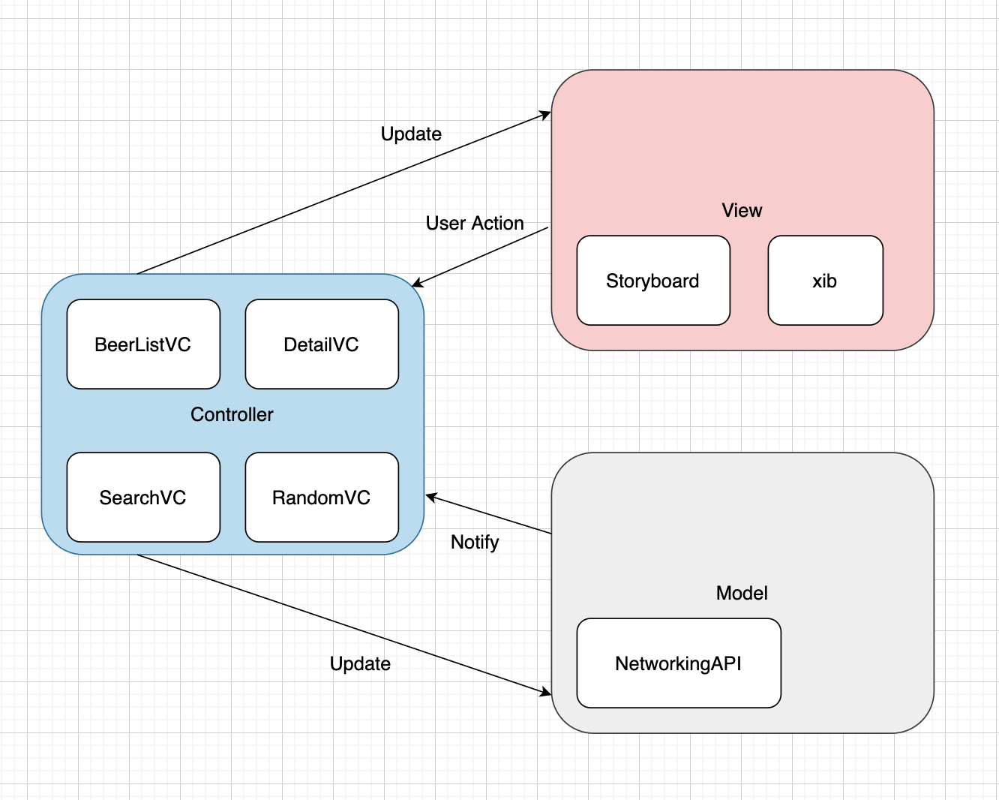

# MVC

- Model: The data used in the application and the part that processes the data.
- View: The part of the UI shown by the user.
- Controller: The part that receives and processes user input (Action).

The Model manages the data to be used in the application, and the View expresses and manages the UI. The Controller acts as a bridge between the View and the Model so that the Model reflects the input of the View and updates the Model change to the View.

## 🙂 Advantages

- The amount of code is small compared to other patterns.
- Also, since it is a pattern that is basically supported by Apple, it is easily accessible.
- Because it is a familiar pattern to many developers, developers can easily maintain it.
- Its fast development speed makes it ideal for use when architecture is not critical or for smaller projects.

## 🙁 Disadvantages

However, Apple's MVC pattern is different from the existing MVC pattern. 

- First of all, the View and the Controller are connected too **closely** as shown in the picture above. As can be seen from ViewController, View and Controller are attached, and it is **difficult to separate** View and Controller because the Controller manages the life cycle of the View. This reduces reusability and makes unit testing difficult. Also, most of the code can be dense in the Controller.

- In addition to life cycle management, if many codes such as delegate or datasource, network request, and data request to DB are written in the controller, the size of the controller becomes enlarged and the internal structure becomes complicated. By analogy with this situation, many people call it a **Massive View Controller.**

This complex code makes it difficult to maintain as the size of the project grows.

## [MVC Example - storyboard](https://github.com/Goeun1001/ios-architectures/tree/master/MVC-storyboard)

### Reference

- [[iOS] MVC, MVP, MVVM 비교](https://beomy.tistory.com/43)

