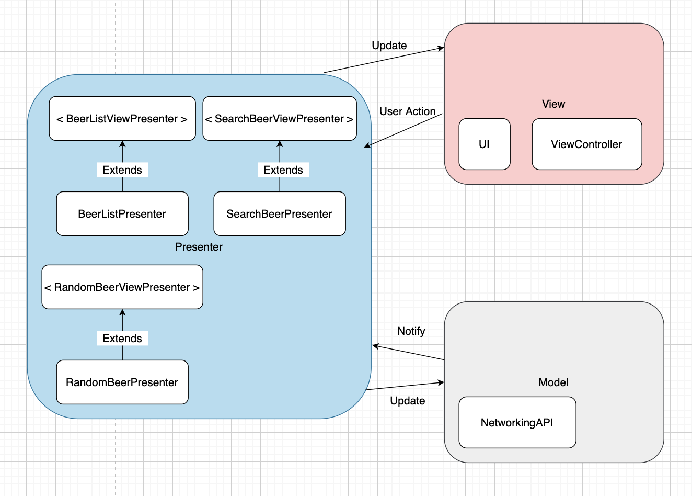

# MVP


- Model: The data used in the application and the part that processes the data. 
- View: The part of the UI shown by the user. 
- Presenter: This is the part that processes the model with the information requested by the view and delivers it to the view. The medium that connects the View and the Model

Presenter and View have a 1:1 relationship.

```
protocol BeerListView: AnyObject {
    func onItemsRetrieval(beers: [Beer])
    func onItemsReset(beers: [Beer])
}
```

```
protocol BeerListViewPresenter: AnyObject {
    init(view: BeerListView)
    func viewDidLoad()
    func refresh()
    func getNextPage()
    func getCurrentPage() -> Int
}
```


## 🙂 Advantages

- Most of the roles have been taken over by Presenter and Model.

In Apple MVC, if the View Controller belongs to the Controller Layer and actually handles all UI and core logic, In the MVP pattern, the **responsibilities are separated.**

- Therefore, it can be seen that the testability of business logic is improved.

- Since you need to define a class that acts as a presenter, the code is almost double that of MVC, but the goal of MVP has been achieved.

## 🙁 Disadvantages

Since you have to create **manual** data or event bindings separately, there is also a cost for development speed.

First, the View must own the Presenter, and the Presenter must update the View according to user actions, data updates, and state updates. When implementing this as code, the View owns the Presenter with a strong reference and the Presenter simply points to the View with a weak reference. Therefore, it is possible to escape from the influence of the life cycle of the View and the dependency such as the coexistence of the layout code and the action code, but there is a limit that it cannot escape from the **1:1** dependency by reference.


## [MVP Example](https://github.com/Goeun1001/ios-architectures/tree/master/MVP-snapKit)



### Reference

- [[iOS] MVC, MVP, MVVM 비교](https://beomy.tistory.com/43)