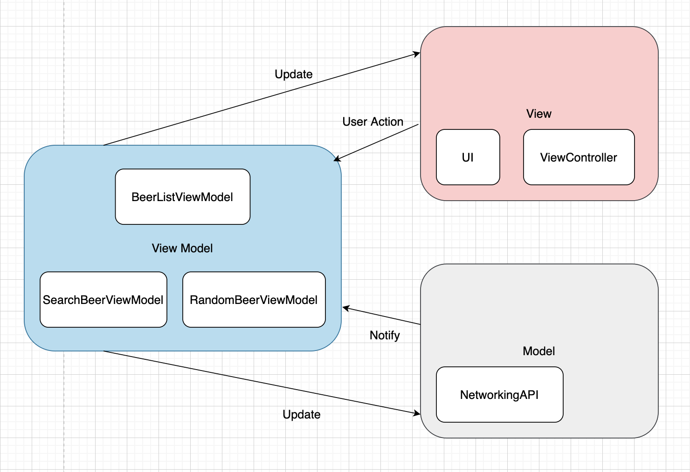

# MVVM

- Model: The data used in the application and the part that processes the data.
- View: The part of the UI shown by the user.
- View Model: A model for the View created to express the View. It is a model to represent the view and a part that processes data to represent the view.

View only needs to do the following:

1. Initiate/Layout/Present UI components.
2. Bind UI components with the ViewModel.

ViewModel only needs to do the following:

1. Write controller logics such as pagination, error handling, etc.
2. Write presentational logic, provide interfaces to the View.

## 🙂 Advantages

- ViewModel is that there is no dependency or connectivity to View from ViewModel through binding.
- In the MVVM pattern, the ViewModel is unaware of the View. Only View has ViewModel as an instance, and data of ViewModel is displayed in View through data binding. Therefore, it is not necessarily tied to a ‘one-to-one’ relationship, but a **‘many-to-many’** relationship is possible if necessary. Therefore, redundant logic can be reduced and coupling degree can be reduced.

## 🙁 Disadvantages

- Data binding is essential. Binding is possible through various methods, but you have to write Boilerplate code for that task. So, when creating a simple View or logic, you may see a case where the belly button is bigger than the belly button.

  <i>Boilerplate code: A small but irreplaceable section of code that should be included in multiple places. A programmer has to write a lot of code to do a very small task.</i>

- Doing too many things in the ViewModel is also pointed out as a problem. To solve this, the concept of Builder or Router was actually introduced.

## [MVVM Example - storyboard](https://github.com/Goeun1001/ios-architectures/tree/master/MVVM-RxSwift-storyboard)

### Reference

- [[iOS] MVC, MVP, MVVM 비교](https://beomy.tistory.com/43)

